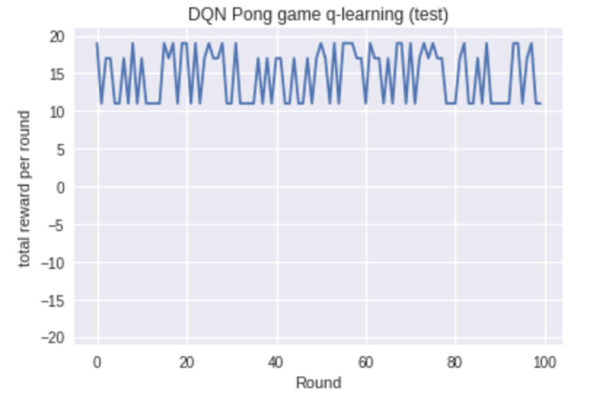

# Deep-Q-learning for Pong Game
In our project, we apply Deep Q-Learning algorithm to solve the Pong Game problem. This reinforcement learning method is built using Pytorch, based on Max Lapan?s: Speeding up DQN on PyTorch: how to solve Pong in 30 minutes.

## Getting Started 
These instructions will show you how to run the code on your local machine for development and testing purposes.

Please upload the notebook dqn_pong.ipynb to colab and follow the instructions to run the code.

### Prerequisites
torch-1.0.0

gym-0.10.9

pyglet-1.3.2

atari-py-0.1.7

env_wrapper.py

### Installation
Run the following command to install necessary packages.
```
!pip install gym
!pip install torch
!pip install atari_py
```
### Upload
Before running the jupyter notebook, please make sure to upload the the env_wrapper.py to google file.

### How to run :
Run the code cells one by one.

### Results
Got 100% wining rate. 

The reward vs round plot shows as below.



One of the results is presented below.


## Notes
The trail has been recorded in 32.log file and the model has been saved in batch_32_pong.model file.

If you want to reproduce the DQN training plot without retraining the model, you need to uncomment the 'break' in training process code cell. Then upload the 32.log to google file and run the result of training code cell.

If you want to reproduce the test result without retraining the model, you can simply upload the batch_32_pong.model  to google file and run the test code cell.
